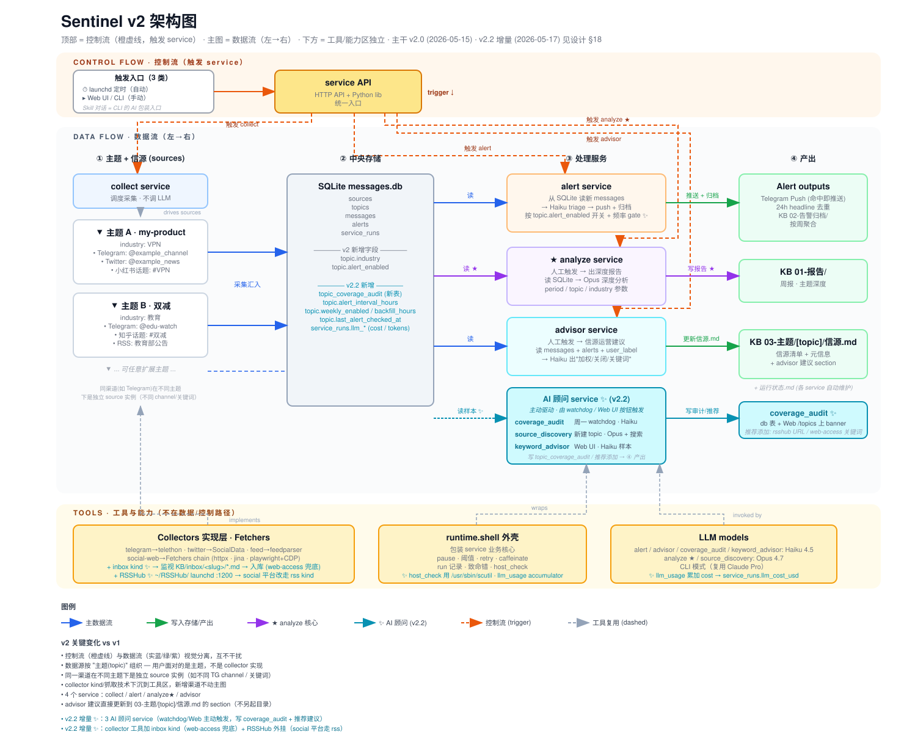

# Sentinel v2

通用主题舆情雷达。订阅 Telegram / RSS / Twitter / Reddit / RSSHub 信源，按主题聚合，LLM 自动 triage 发警报 + 出深度报告。

## 架构



数据流（左→右）+ 控制流（顶部橙虚线，触发 service）+ 工具能力区（下方独立）三轨布局。详见 [docs/design.md](docs/design.md) §1。

## 状态

**v2.2 (2026-05-17)** · 215 测试全过 · 4 service + 3 AI advisor + 6 collector kind · macOS launchd 接管 (6 plist + 可选 RSSHub plist)

- **4 主 service**: collect / alert / analyze ★ / advisor
- **3 AI 顾问 service** (v2.2): coverage_audit · source_discovery · keyword_advisor
- **6 collector kind**: telegram · rss · twitter · reddit · social · inbox
- **3 入口**: Web UI (推荐) · CLI · 自定义 Claude Skill

## 文档

| 文件 | 谁看 | 内容 |
|---|---|---|
| 本 README | 第一次接触 | 5 分钟跑通 + 路径约定 + 命令速查 + launchd 部署表 + Web UI 概览 |
| [docs/user-guide.html](docs/user-guide.html) | 日常运营 | 完整运营手册（50K · 下载到本地浏览器打开看更佳）：每个 service 详解 / Web UI 操作 / FAQ / 故障排查 |
| [docs/design.md](docs/design.md) | 想懂内部 | 系统设计 SSoT：架构 §1 / 数据模型 §2 / service 层 §3 / KB 结构 §5 / v2.1+v2.2 增量摘要 §11 / 4 条架构原则附录 A |
| [docs/architecture.svg](docs/architecture.svg) | 30 秒概览 | 视觉架构图（即上方嵌入版） |

## 5 分钟跑通

依赖：macOS · Python 3.12 · Anthropic 订阅（CLI 模式）或 ANTHROPIC_API_KEY (API 模式)。

```bash
# 1. 装依赖
brew install python@3.12
git clone <this-repo> sentinel-v2 && cd sentinel-v2
python3.12 -m venv .venv && source .venv/bin/activate
pip install -e ".[dev]"

# 2. 配密钥
cp secrets/.env.example secrets/.env
chmod 600 secrets/.env
$EDITOR secrets/.env       # 填 TELEGRAM_API_ID/HASH 或 ANTHROPIC_API_KEY 等

# 3. 配主配置
cp config.yaml.example config.yaml
# cli_path 留空 → 启动自动 `which claude` 探测；想用 api 模式改 provider: api

# 4. 开 Web UI
python -m sentinel web      # http://127.0.0.1:8080
# 浏览器加 topic / source → 点 "立即跑 collect" 开始抓
```

## 路径约定

| 路径 | 用途 | 覆盖方式 |
|---|---|---|
| `~/sentinel-v2/` | 项目根（代码 + db + 配置） | env `SENTINEL_HOME` |
| `~/Documents/Sentinel/` | 产出根（报告 + 告警归档 + 主题信源.md） | env `SENTINEL_KB_ROOT` |

产出根包含：

```
~/Documents/Sentinel/
├── 01-报告/                                      analyze service 写
│   ├── 周报/                                    YYYY-W##-{topic}-周报.md
│   └── 主题深度报告/                              YYYY-MM-DD-{headline-slug}.md
├── 02-告警归档/                                  alert 写（按周聚合）
├── 03-主题/<topic>/信源.md                       collect/advisor 维护
├── inbox/<topic-slug>/*.md                       web-access 兜底落 markdown
├── _archive/backups/                             SQLite gzip 日备
└── 运行状态.md                                    service 自动维护
```

## 常用命令

```bash
# 手动跑 service
python -m sentinel collect run [--force]
python -m sentinel alert run [--force] [--dry-run-push]
python -m sentinel analyze report --topic "X" --period 7d
python -m sentinel analyze weekly               # 跑所有 weekly_enabled topic
python -m sentinel advisor scan --topic "X"

# 暂停 / 恢复
python -m sentinel <collect|alert> pause [--days N]
python -m sentinel <collect|alert> resume

# launchd 长驻部署
python -m sentinel deploy install   # 渲染 6 plist 到 ~/Library/LaunchAgents/
python -m sentinel deploy status
python -m sentinel deploy uninstall

# 状态查询
python -m sentinel status [--service collect|alert|analyze|advisor]

# 测试
pytest -v
```

## launchd 部署后

`deploy install` 渲染 6 plist：

| plist | 触发 | 行为 |
|---|---|---|
| `local.sentinel.collect` | 02 / 08 / 14 / 20 | 抓所有 enabled source |
| `local.sentinel.alert` | 02:30 / 08:30 / 14:30 / 20:30 | triage + push + KB 归档（按 per-topic 频率 gate） |
| `local.sentinel.weekly` | 周日 22:00 | 跑所有 weekly_enabled topic 的 7d 深度报告 |
| `local.sentinel.backup` | 每天 23:30 | SQLite gzip → `_archive/backups/` + rotate-logs |
| `local.sentinel.watchdog` | 每天 09:00 | 巡检 collect/alert/backup/weekly + 周一 coverage audit |
| `local.sentinel.web` | 长驻 | Web UI 127.0.0.1:8080，开机自启 + 崩溃自启 |

（可选）社交平台 (V2EX/B 站/即刻 等) 走 RSSHub：自己装 [RSSHub](https://docs.rsshub.app/)，配 launchd 长驻 :1200，source 用 `rss` kind 填 `http://127.0.0.1:1200/<route>`。

## Web UI

| URL | 功能 |
|---|---|
| `/` | dashboard · KPI / 趋势 / 覆盖审计 banner / 快失活源 |
| `/sources` | 信源（按 kind 分组 + 三层引导新建表单） |
| `/topics` | 主题（alert / weekly / 频率 toggle · backfill / 覆盖审计 badge） |
| `/topics/{id}` | 详情（关键词 + AI 推荐 + 覆盖审计面板 + 手动 analyze/advisor） |
| `/alerts` | 告警（filter + 展开 related messages + 一键标记） |
| `/reports` `/reports/view` | 周报 / 深度报告 / 告警归档 |
| `/status` | service_runs (LLM tok+cost / 立即跑 watch mode) |
| `/cost` | LLM 成本按月聚合 |
| `/health` | health-check JSON |

默认 `127.0.0.1:8080`，不监听外网。

## 多机感知

`deploy install` 把本机 hostname 写到 `<KB_ROOT>/00-系统设计/.host`。其他机器跑 service 会被 host check 退出，避免污染主机数据。切机：旧机 `deploy uninstall` → 新机 `deploy install`。

## License

MIT · 见 [LICENSE](LICENSE)
